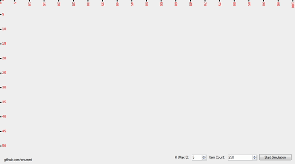

# K-Means Visualization

K-Means Clustering Visualizing - 2018 (C#)

K-Means Algorithm Steps

<ul>
  <li>Pick a number (k) of cluster centers</li>
  <li>Assign every gene to its nearest cluster center</li>
  <li>Move each cluster center to the mean of its assigned genes</li>
  <li>Repeat 2-3 until convergence</li>
</ul>

K-Means doesn't require installation.

<a href="https://github.com/onursert/K-Means/raw/master/KMeans.exe">Download K-Means</a>
